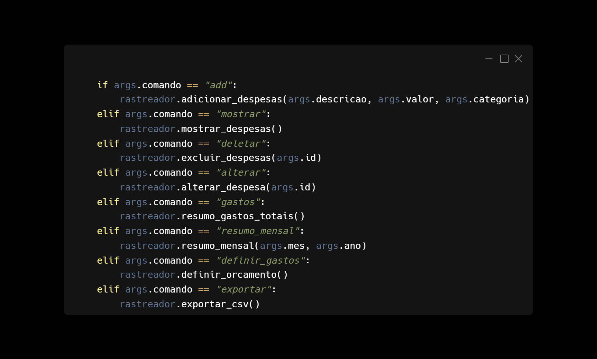

# Rastreador de Despesas

Neste projeto serão colocadas em práticas para que no fim seja entregue um rastreador de despesas via CLI.  
Este projeto esta na minha base de projetos retirados do site [Roadmap.sh](https://roadmap.sh/u/bruunovsanttos), estou seguindo os projetos da trilha de back-end.

## Requisitos de Projeto 📏📐
> O aplicativo deve ser executado na linha de comando e deve ter os seguintes recursos:
>
>1. Os usuários podem adicionar uma despesa com uma descrição e valor.
>2. Os usuários podem atualizar uma despesa.
>3. Os usuários podem excluir uma despesa.
>4. Os usuários podem visualizar todas as despesas.
>5. Os usuários podem visualizar um resumo de todas as despesas.
>6. Os usuários podem visualizar um resumo das despesas de um mês específico (do ano atual).
##### Recursos Adicionais
>O aplicativo deve ser executado na linha de comando e deve ter os seguintes recursos:
>
>7. Os usuários podem adicionar uma despesa com uma descrição e valor.
>8. Os usuários podem atualizar uma despesa.
>9. Os usuários podem excluir uma despesa.
>10. Os usuários podem visualizar todas as despesas.
>11. Os usuários podem visualizar um resumo de todas as despesas.
>12. Os usuários podem visualizar um resumo das despesas de um mês específico (do ano atual).

## Ferramentas Do projeto 🔨🔧  
### Lingaugem de programação
#### Python 3.12  🐍
### Bibliotecas Utilizadas📚

[Argparse](https://docs.python.org/pt-br/3/library/argparse.html#module-argparse) a utilização dessa biblioteca consiste na maipulação correta dos argumentos dados pelo usuário do programa não havendo erros.  

[JSON](https://docs.python.org/pt-br/3/library/json.html) utilizada para a manipulação do arquivo que serve de base para as adiões e atulizações de despesas.  

[CSV](https://docs.python.org/pt-br/3/library/csv.html#module-csv) utilizada para a conversão dos dados para um arquivo CSV.  

[Datetime](https://docs.python.org/pt-br/3/library/datetime.html) utilizado para a atualização de datas do programa nos prints de criação e modificação.    

[OS](https://docs.python.org/pt-br/3/library/os.html#module-os) para manipulação de caminhos do programa e controle dos arquivos.    

### Comandos
Os comandos utlizados para funcionar o sistema de rastreamento são :  

